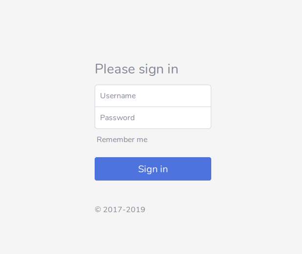
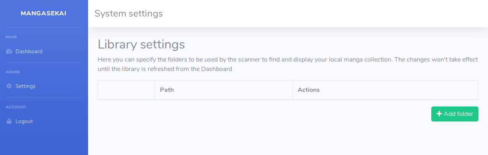
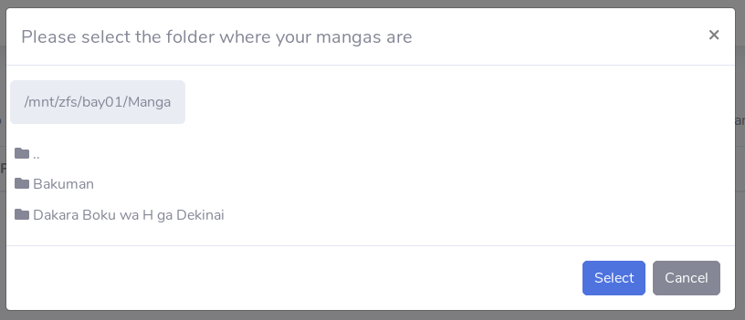
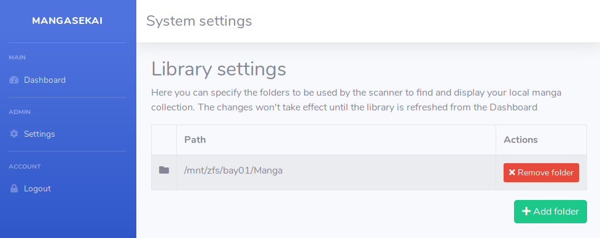
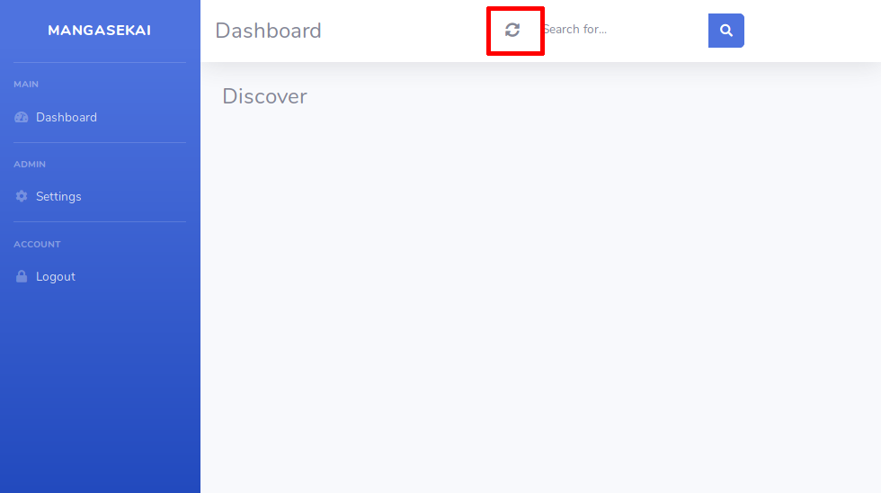
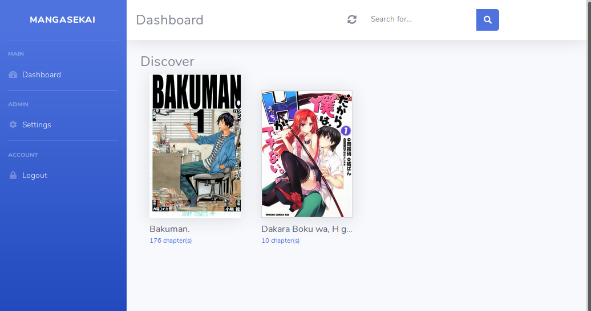
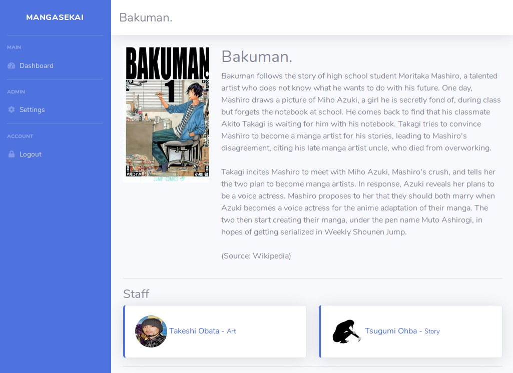

**IMPORTANT**: THIS PROJECT IS IN ARCHIVE MODE AS A PROPER REWRITE FOR BOTH THE BACKEND AND FRONTEND HAS STARTED TO TAKE IT TO THE NEXT LEVEL.


This project uses bootstrap template from https://startbootstrap.com/themes/sb-admin-2/

Eyes on the logo from LordBarta on deviantart: https://www.deviantart.com/lordbarta/art/Shock-Eyes-589962803

# 1. What is MangaSekaiProject
Manga Sekai Project aims to provide a fast, selfhosted alternative to online manga readers. Keep track of your reading status, tag and organize your local library and keep it up to your quality standards.

# 2. Requirements
- PHP 7.2 or newer
- Composer
- A web server

# 3. How to use
## 3.1. Pre-requirements
Before beginning the installation you'll need to ensure that composer is installed and that the web server is able to run .php files from the folder where you're going to install. For the example, we'll use the directory "/var/lib/mangasekaiproject"

## 3.2. Installing
First clone the repository to the desired location.
```
cd /var/lib/
git clone https://github.com/Almamu/MangaSekaiProject.git
```
Once cloned we'll setup the project dependencies with composer:
```
cd /var/lib/MangaSekaiProject/
composer install
```
The last step is generating the database files, there is an embedded tool that takes care of everything
```
php bin/config
```
This will create a database.sqlite file with the required structure and an example user.
**IMPORTANT: The folder where this file is stored and the database file itself have to be writable by the user under which PHP is run**

## 3.3. Configuration
Once the environment is setup you should be able to access the application trough your webbrowser. You'll be greeted by the login page

 

The default username and password is admin.
To start scanning your manga collection you'll need to specify the folder where your manga is stored. Go to the "settings" section on the left



Click on "Add folder" and navigate to the main directory where your manga is stored. If you have more than one directory where you save manga you can add as much folders as you want.





Once you've selected all the folders where you store your mangas you need to refresh the library in order to scan the folders and download the basic manga information. You can do so clicking on the "reload" icon on the top-right of the dashboard.



After some time your mangas should appear with their cover art, description and staff involved.





# 4. Keep your library organized
Right now Manga Sekai Project expects the following folder structure:
- Manga Name
    - Chapter 1
        - 1.jpg 
        - 2.jpg
        - 3.jpg
        - 4.jpg
        - ...
        
The chapter's folder name doesn't really matter as long as there is a number in it. The same happens with the page files.
Any of the folders can be a zip, so these two structures should also work:
- Manga Name.zip
    - Chapter 1
        - 1.jpg 
        - 2.jpg
        - 3.jpg
        - 4.jpg
        - ...
        
or
- Manga Name
    - Chapter 1.zip
        - 1.jpg 
        - 2.jpg
        - 3.jpg
        - 4.jpg
        - ...
